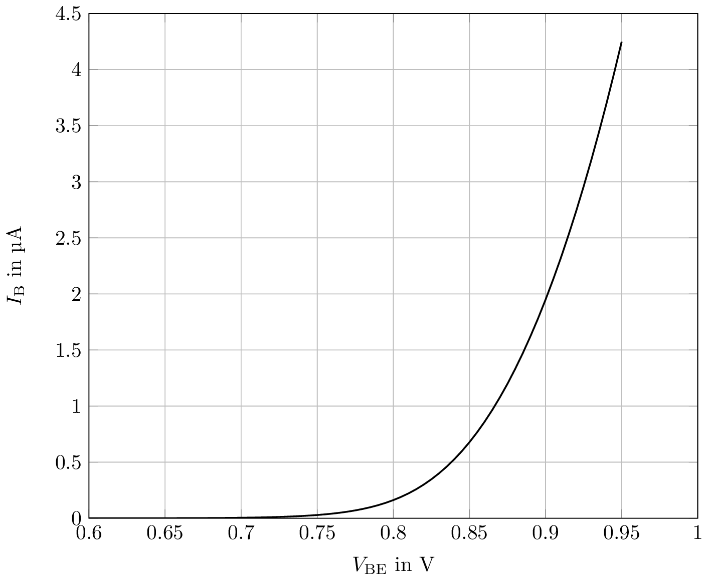
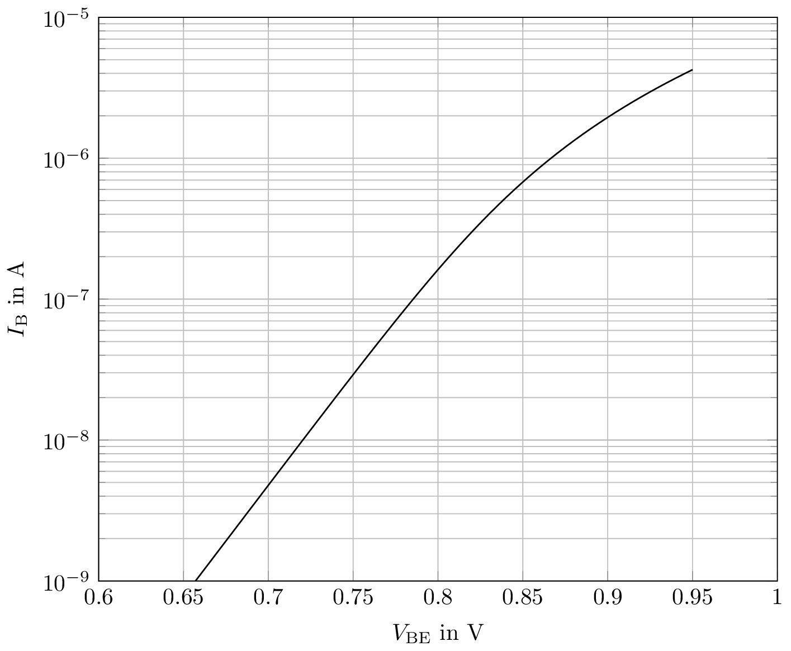
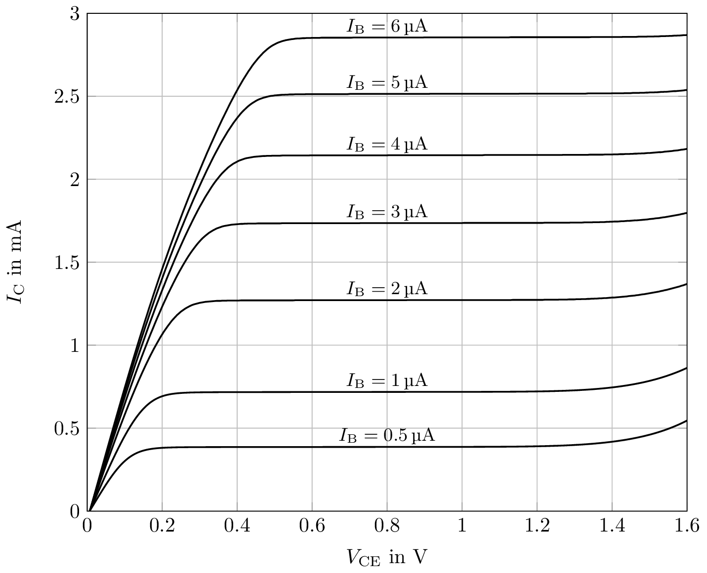
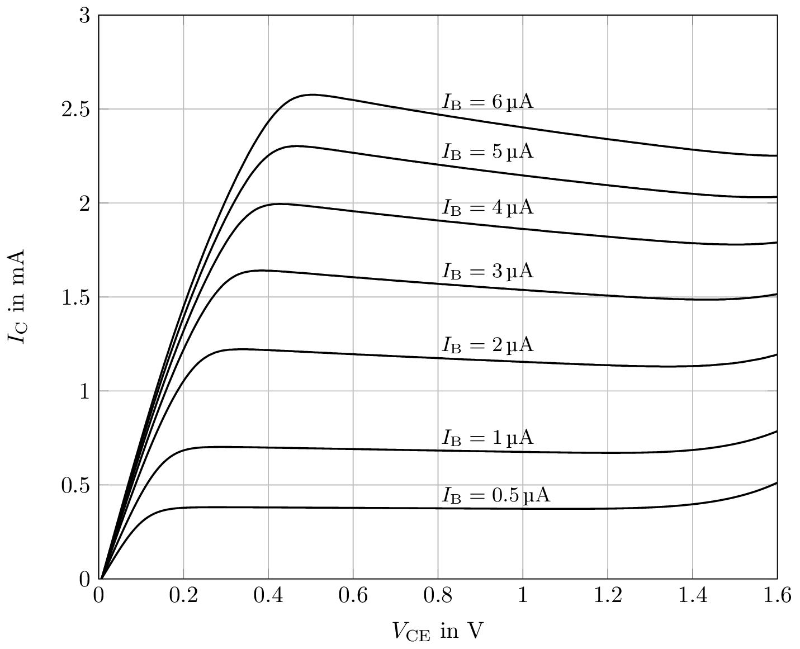

# ihp-sg13g2-charts

This repository contains some charts of some devices in 
[IHP SH13G2](https://github.com/IHP-GmbH/IHP-Open-PDK) that were 
obtained with simulation via Cadence Spectre.
Unless otherwise stated:
- T=27°C
- nom. process

## npn13G2

- input characteristic without self-heating
  
  

- input characteristic with self-heating

- output characteristic without self-heating
  

- output characteristic with self-heating
  

- gain without self-heating

- gain with self-heating

- transit frequency without self-heating

- transit frequency with self-heating

